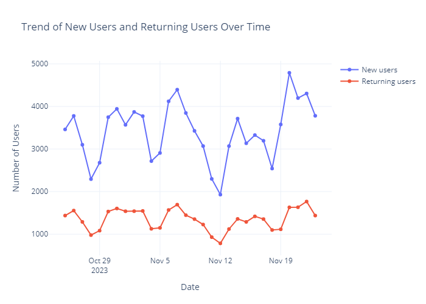
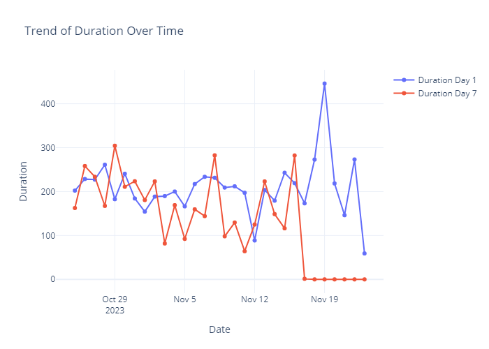
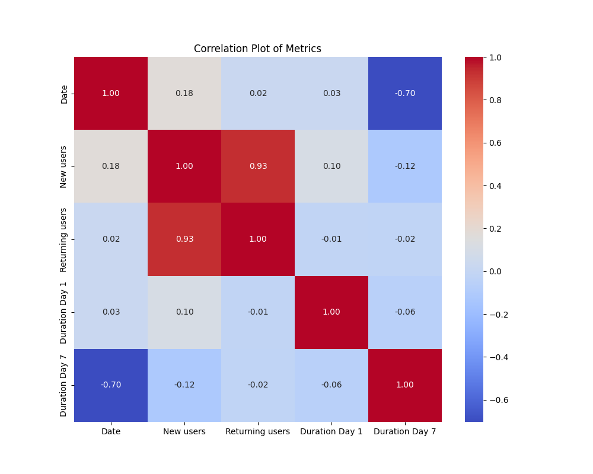
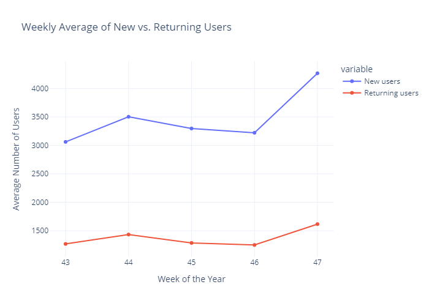
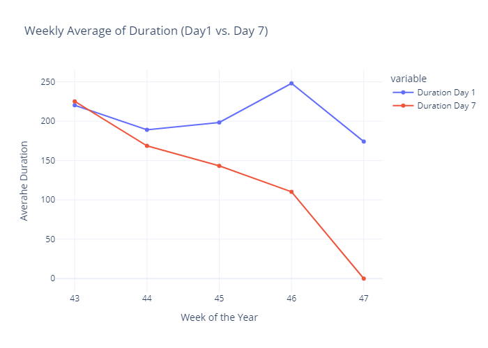
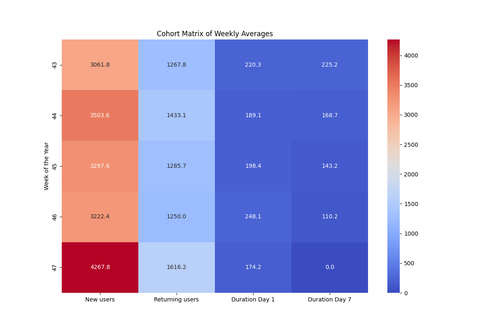
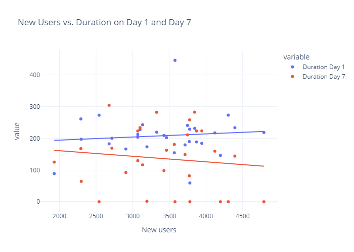
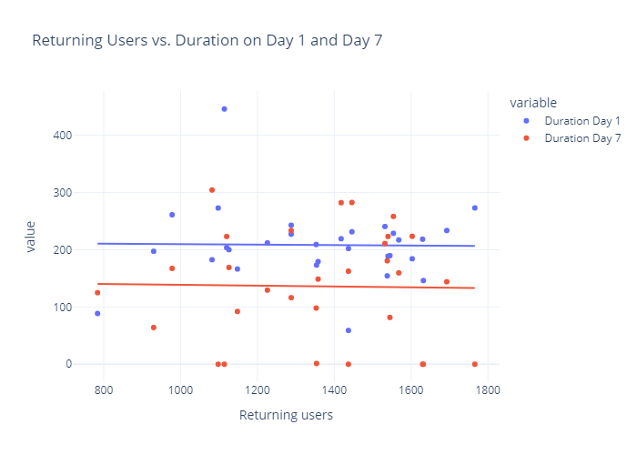
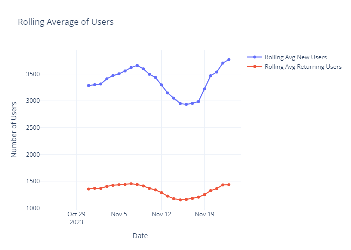

# Cohort Analysis

## Overview

This project focuses on analyzing user engagement patterns on a platform using various data analysis techniques. The primary goal is to understand user behavior over time, identify trends, and provide insights into user retention and engagement strategies. The analysis includes trend analysis, correlation analysis, cohort analysis, and daily engagement analysis, leveraging visualizations to derive actionable insights.

## Exploratory Data Analysis (EDA) performed:

### Trend analysis:
- To understand the trend of new and returning users over a specified period.

### Trend of duration over time:
- To analyze how user engagement (measured by session duration) changes over time on Day 1 and Day 7.

### Correlation Analysis:
- To examine the relationships between different metrics, such as new users, returning users, and session durations.

## Cohort Analysis:

### Weekly Average Users:
- To analyze the average number of users (new and returning) per week.

### Weekly Average Duration:
- To track the average session duration on Day 1 and Day 7 across different weeks.

### Cohort Matrix:
- To visualize user retention and activity over time for different cohorts (groups of users who joined in the same period).

### Daily Engagement Analysis:
- To examine the engagement levels of new and returning users from Day 1 to Day 7.

### Rolling Averages:
- To smooth out short-term fluctuations and highlight long term trends in user engagement metrics.

## Conclusion

This project builds on the foundational work provided in The Clever Programmer's Cohort Analysis using Python by expanding the analysis to provide deeper insights into various other aspects of the user behavior and in turn Cohort Analysis.
Cohort analysis reveals key insights into user retention over time, while daily engagement analysis underscores the critical first week of user interaction. These findings can inform targeted strategies to enhance user retention and maximize long-term engagement.

## References:
1. [Cohort Analysis](https://en.wikipedia.org/wiki/Cohort_analysis)
2. [Project Reference](https://thecleverprogrammer.com/2023/11/27/cohort-analysis-using-python/)
3. [Dataset](https://statso.io/cohort-analysis-case-study/)
